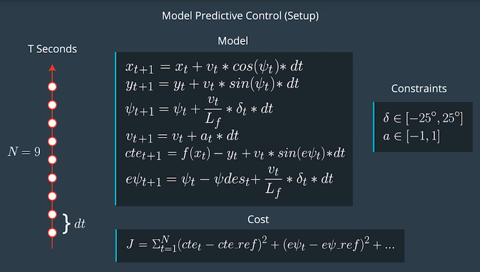
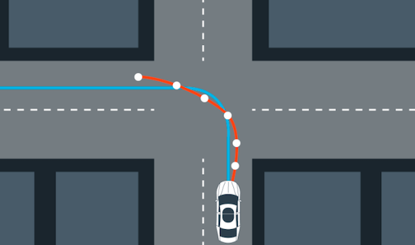

# CarND-Controls-MPC

[](https://youtu.be/JJqCovkQoMc)

---

## Objective

The purpose of this project is to implement a model predictive controller (MPC) to steer a car around a simulated track. The simulator provides a data stream about car's position speed and orientation.

## Model Predictive Control



The MPC frames the task of following a trajectory as an optimization problem of minimizing a cost function. MPC holds internal representation of the motion model and uses the motion model to evaluate N future states (horizon length) of each actuation combination from an accepted range and picks one that minimizes the cost.

We need to constantly recalculate the optimal trajectory to take into account of errors in the actuators (calculating inputs over a future horizon).

### 1. Vehicle Motion Model

Here we use a kinematic bicycle model to represent the motion of the vehicle. The model neglects inertia, friction, torque and other forces, but is non-linear because it takes into account of the heading direction. There are 6 dimensions in the state of this model:

1. x position
2. y position
3. `psi` heading direction
4. velocity
5. cross-track error `cte`
6. orientation error `epsi`

Below are the equation associated with each dimension:

    // x_[t+1] = x[t] + v[t] * cos(psi[t]) * dt
    // y_[t+1] = y[t] + v[t] * sin(psi[t]) * dt
    // psi_[t+1] = psi[t] + v[t] / Lf * delta[t] * dt
    // v_[t+1] = v[t] + a[t] * dt
    // cte[t+1] = f(x[t]) - y[t] + v[t] * sin(epsi[t]) * dt
    // epsi[t+1] = psi[t] - psides[t] + v[t] * delta[t] / Lf * dt

For calculating `cte` and `epsi` we can use the following function to simply the above equation:

    cte = desired_y - actual_y
        = polyeval(coeffs,px)-py
        = polyeval(coeffs,0)  //because px=py=0
    epsi =  actual psi-desired psi
         = psi - atan(coeffs[1]+ coeffs[2]*2*px + ...) 
         = -atan(coeffs[1])  //because px=psi=0

### 2. Polynomial Fitting



All computations are done in vehicle's coordinate system, where the origin is the current position of the vehicle, with the x-axis aligned to the current heading position. The waypoints are calculated in the frame of the vehicle after transforming from the origin coordinate. `transformGlobalToLocal()` implements such transformation into the vehicle coordinate system. The transformation is mathematically defined as below:

    X' = cos(psi) * (ptsx[i] - x) + sin(psi) * (ptsy[i] - y);
    Y' = -sin(psi) * (ptsx[i] - x) + cos(psi) * (ptsy[i] - y);  

where X',Y' denote coordinates in the vehicle coordinate system. Note that the initial position of the car and heading direction are always zero in this frame. Thus the state of the car in the vehicle cordinate system is (**without considering latency**):

    state << 0, 0, 0, v, cte, epsi;

### 3. Prediction Horizon

The prediction horizon is the duration over which future predictions are made. We’ll refer to this as T.

T is the product of two other variables, N and dt.

N is the number of timesteps in the horizon. dt is how much time elapses between actuation.

N, dt, and T are hyperparameters needed to be tuned. There are some general guidelines. T should be as large as possible, while dt should be as small as possible.

These guidelines create tradeoffs.
Specifically, Short prediction horizons lead to more responsive controllers, but is unstable and less accurate. Long prediction horizons are smoother controllers. 

### 4. Number of Timesteps

The goal of Model Predictive Control is to optimize the control inputs: [δ,a]. An optimizer will tune these inputs until a low cost vector of control inputs is found. The length of this vector is determined by N:

```[δ_1, a_1, δ_2, a_2 , ..., δ_N-1, a_N-1]``

Thus N determines the number of variables optimized by the MPC. This is also the major driver of computational cost.

### 5. Timestep Duration

MPC attempts to approximate a continuous reference trajectory by means of discrete paths between actuations. Larger values of dt result in less frequent actuations, which makes it harder to accurately approximate a continuous reference trajectory. This is sometimes called "discretization error".

A good approach to setting N, dt, and T is to first determine a reasonable range for T and then tune dt and N appropriately, keeping the effect of each in mind.

### 6. Latency

MPC can handle latency in our calculation and computation for optimal control inputs. The motion model can take into account of such latency by adding noise to the elapsed time interval.

In this project, we assume a 100ms latency in between each actuation calculation.

Two common approaches:

1. Based on the car's current position and velocity, propagate the estimated position of the car forward at the expected time when actuation take effects. The trajectory is then determined 

2. The trajectory is solved from the current position and time. To take latency into account, the controls of the previous iteration is restrained for the duration of the latency. In short, the trajectory is computed starting from the time of the last iteration PLUS the latency period.

For this project, I choose the first approach. This is implemented in the `main.cpp` before calling `MPC::Solve()`:

    double delta = j[1]["steering_angle"]; 
    delta*=-1; //  change of sign because turning left is negative sign in simulator but positive yaw for MPC
    psi = 0;
    px = px + v*cos(psi)*latency; 
    py = py + v*sin(psi)*latency;
    cte= cte + v*sin(epsi)*latency;
    epsi = epsi + v*delta*latency/Lf;
    psi = psi + v*delta*latency/Lf;
    v = v + a*latency;

This is can be simplified to follow (assume px, py, psi and acceleration to be 0):

    px = v * dt; 
    py = 0;
    psi = -v/Lf * steer_value * dt;
    cte += v * sin(epsi) * dt;
    epsi += epsi - v * steer_value * dt/Lf;


## Dependencies

* cmake >= 3.5
 * All OSes: [click here for installation instructions](https://cmake.org/install/)
* make >= 4.1(mac, linux), 3.81(Windows)
  * Linux: make is installed by default on most Linux distros
  * Mac: [install Xcode command line tools to get make](https://developer.apple.com/xcode/features/)
  * Windows: [Click here for installation instructions](http://gnuwin32.sourceforge.net/packages/make.htm)
* gcc/g++ >= 5.4
  * Linux: gcc / g++ is installed by default on most Linux distros
  * Mac: same deal as make - [install Xcode command line tools]((https://developer.apple.com/xcode/features/)
  * Windows: recommend using [MinGW](http://www.mingw.org/)
* [uWebSockets](https://github.com/uWebSockets/uWebSockets)
  * Run either `install-mac.sh` or `install-ubuntu.sh`.
  * If you install from source, checkout to commit `e94b6e1`, i.e.
    ```
    git clone https://github.com/uWebSockets/uWebSockets
    cd uWebSockets
    git checkout e94b6e1
    ```
    Some function signatures have changed in v0.14.x. See [this PR](https://github.com/udacity/CarND-MPC-Project/pull/3) for more details.

* **Ipopt and CppAD:** Please refer to [this document](https://github.com/udacity/CarND-MPC-Project/blob/master/install_Ipopt_CppAD.md) for installation instructions.
* [Eigen](http://eigen.tuxfamily.org/index.php?title=Main_Page). This is already part of the repo so you shouldn't have to worry about it.
* Simulator. You can download these from the [releases tab](https://github.com/udacity/self-driving-car-sim/releases).
* Not a dependency but read the [DATA.md](./DATA.md) for a description of the data sent back from the simulator.


## Basic Build Instructions

1. Clone this repo.
2. Make a build directory: `mkdir build && cd build`
3. Compile: `cmake .. && make`
4. Run it: `./mpc`.

## Tips

1. It's recommended to test the MPC on basic examples to see if your implementation behaves as desired. One possible example
is the vehicle starting offset of a straight line (reference). If the MPC implementation is correct, after some number of timesteps
(not too many) it should find and track the reference line.
2. The `lake_track_waypoints.csv` file has the waypoints of the lake track. You could use this to fit polynomials and points and see of how well your model tracks curve. NOTE: This file might be not completely in sync with the simulator so your solution should NOT depend on it.
3. For visualization this C++ [matplotlib wrapper](https://github.com/lava/matplotlib-cpp) could be helpful.)
4.  Tips for setting up your environment are available [here](https://classroom.udacity.com/nanodegrees/nd013/parts/40f38239-66b6-46ec-ae68-03afd8a601c8/modules/0949fca6-b379-42af-a919-ee50aa304e6a/lessons/f758c44c-5e40-4e01-93b5-1a82aa4e044f/concepts/23d376c7-0195-4276-bdf0-e02f1f3c665d)
